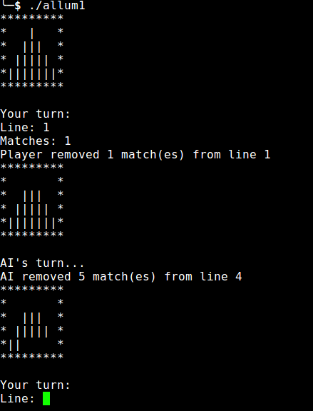

# CPE_2015_Allum1
Epitech first year project : [CPE] Allum1

Deadline : 3 weeks

Beginning of the project : 16/12/2015, 07h42

Group size : 1 person

# Allum1

Create the game of Marienbad

* [Marienbad](https://fr.wikipedia.org/wiki/Jeu_de_Marienbad)

## Getting started

These instructions will allow you to obtain a copy of the operational project on your local machine for development and testing purposes.

### Prerequisites

What do you need to install the software and how to install it?

```
gcc
make
```

### Installation

Here's how to start the project on your computer

Clone and go in the directory CPE_2015_Allum1

Project compilation

```
make
```

Running project

```
./allum1
```

## Screenshot



## Build with

* [C](https://en.wikipedia.org/wiki/C_(programming_language))

## Auteurs

* **David Munoz** - [DavidMunoz-dev](https://github.com/davidmunoz-dev)
